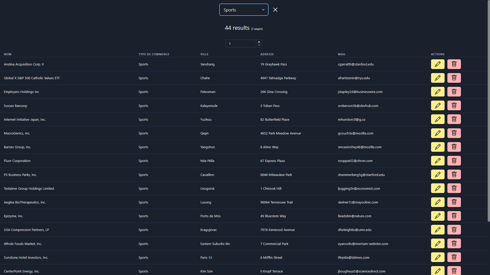

# Markets

## Goal

The goal of this project is to build a fullstack CRUD application using React with the component lib Chakra UI & Express for a Rest  API.

#### Screenshot

## Installation :

- clone the repo
- cd ./server
  - `npm install`
  - `npm run dev` (will run on port 4001)
- cd ./front
  - `npm install`
  - `npm run start` (will run on port 3000)

*If you use Postman the* yourban_tt.json *file will import directly the endpoints to test, otherwise you can still read it as documentation along with the code* 

## Journal :

Day 1 :
-
- Tasks done
  - Initialized the express server & load the JSON Data into a class.
  - Finished Exercise #1 endpoints in the market module.
  - Tested my endpoints & validations handlers with PostMan. 
- Decisions made
  - To use the zod library for inputs validation.
  - To use custom error middlewares to handle unsuccessful request and avoid repeating functionalities.

Day 2 :
- 
- Tasks done
  - Read Chakra UI Documentation.
  - Finished Exercise #2 endpoints in the city & field modules.
- Decisions made
  - To use `Merge Parameter` in order to make the last endpoint of Exercise #2 and avoid repeating functionalities.

Day 3 :
-
- Tasks done
  - Read Chakra UI Document & Figma 
  - Read Atomic Pattern Blog explanation
  - Experiment ChakraUI on Mock folder

Day 6:
-
- Tasks done
  - Finished all Front-End exercises
- Decisions made
  - To use `axios` to interact with the API for more robust calls
  - To add a filter for the fields (with a React Context) for a better User Experience
  - To add client side pagination with a React Context otherwise the 1000 rows would slow the page down

## Resources 

- [Frank Grall's article about Atomic Design (FR)](https://medium.com/@frkgrall/architecturer-un-projet-react-avec-latomic-design-bce9a3e422d0)
- [ChakraUI's documentation](https://chakra-ui.com/getting-started)
